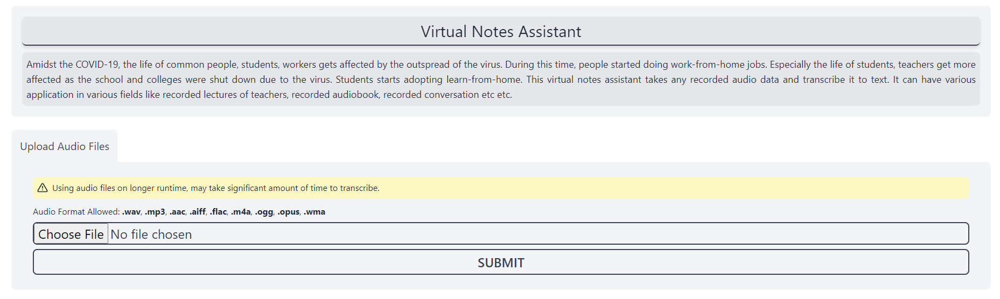
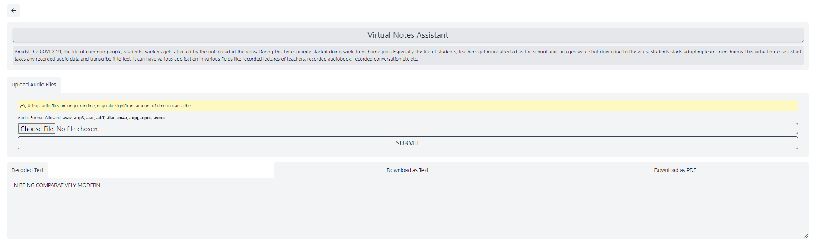

# Virtual Notes Assistant

This is a speech-to-text project where recorded audio files are transcribed. A pretrained model is used for this purpose. The model has been trained on large dataset.

### Input

The web app takes on user's audio file input and gives the output as text. The UI offer the user to select an audio file.

Currently on these audio formats are supported-

* .wav
* .mp3
* .aac
* .aiff
* .flac
* .m4a
* .ogg
* .opus
* .wma

</img>

### Output

The transcribed text is shown as text which can be downloaded as **.txt** or **.pdf** file. Also it can be copied to clipboard.

</img>
